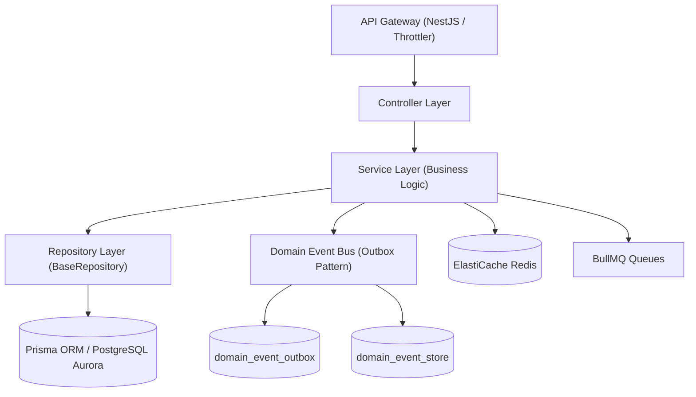

# Dyvin AI Master Enterprise Architecture Blueprint

## System Architecture

```mermaid
graph TD
    Gateway["API Gateway (NestJS / Throttler)"] --> Router["Controller Layer"]
    Router --> Service["Service Layer (Business Logic)"]
    Service --> Repo["Repository Layer (BaseRepository)"]
    Repo --> DB[("Prisma ORM / PostgreSQL Aurora")]

    Service --> EventBus["Domain Event Bus (Outbox Pattern)"]
    EventBus --> Outbox[("domain_event_outbox")]
    EventBus --> Store[("domain_event_store")]

    Service --> Cache[("ElastiCache Redis")]
    Service --> Queues["BullMQ Queues"]
```
